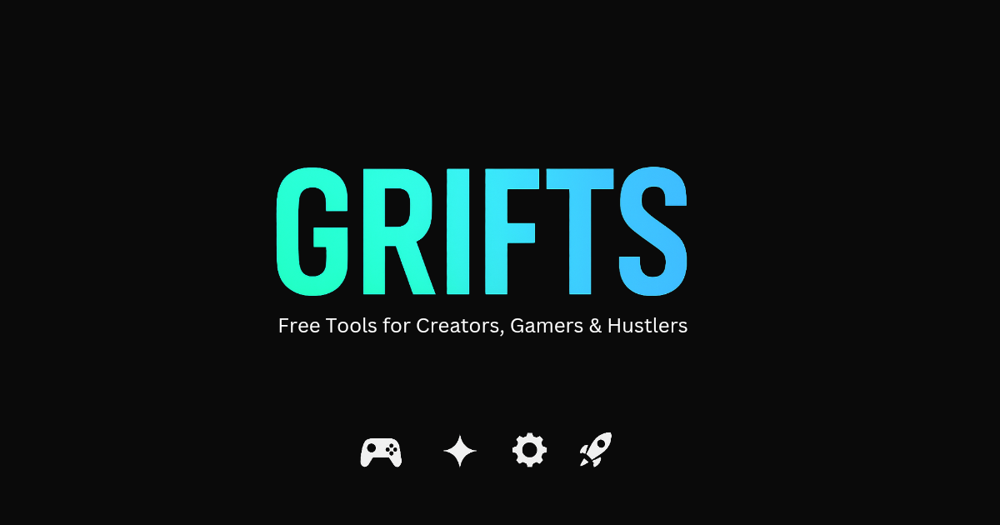

# 🎯 GRIFTS - Tools for Creators, Gamers & Hustlers



**100% free, browser-based tools for content creators, competitive gamers, and side hustlers. No sign-ups. No BS.**

🔗 **Live Site:** [grifts.co.uk](https://grifts.co.uk)

---

## 🚀 Features

### Privacy-First Architecture
- **Zero data collection** - All processing happens in your browser
- **No accounts required** - Instant access to every tool
- **Works offline** - Tools function without internet once loaded
- **In-memory storage** - No localStorage tracking

### Tool Categories

#### 🎮 Gaming Tools (2 tools)
- DPS Calculator
- Elden Ring Build Optimizer

#### ✨ Influencer Tools (4 tools)
- Avatar Generator
- Headline Generator
- *[List others as you add them]*

#### ⚙️ Utilities (5 tools)
- Password Generator
- QR Code Generator
- Resume Builder
- Unit Converter
- *[One more to add]*

#### 🚀 Viral Tools (6 tools)
- Challenge Generator
- Compatibility Calculator
- Emoji Generator
- Meme Captioner
- Poll Widget
- Quiz Generator

---

## 🛠️ Tech Stack

- **Pure HTML5/CSS3/JavaScript** - No frameworks, maximum compatibility
- **Mobile-first responsive design**
- **WCAG AA accessibility compliance**
- **Google Analytics** (optional, can be removed)

---

## 📦 Project Structure

```
grifts/
├── index.html              # Homepage
├── css/
│   └── style.css          # Global styles & design system
├── js/
│   ├── common.js          # Shared utilities (memory store, alerts, etc.)
│   └── [tool-name].js     # Individual tool scripts
├── gaming/
│   └── index.html         # Category page
├── influencer/
├── utilities/
├── viral/
└── assets/
    └── og-image.jpg       # Social sharing image
```

---

## 🎨 Design System

### Color Palette
- **Primary Accent:** #00f5a0 (Neon Green)
- **Secondary Accent:** #00d9f5 (Cyan Blue)
- **Background:** #0a0a0a (Deep Black)
- **Cards:** rgba(255, 255, 255, 0.03)

### Typography
- System font stack for performance
- Mobile-first responsive sizing

---

## 🚀 Adding New Tools

### 1. Create HTML file in appropriate category folder:
```html
<!-- Example: gaming/new-tool.html -->
<!DOCTYPE html>
<html lang="en">
<!-- Copy header from existing tool -->
<body>
    <!-- Include navigation from index.html -->
    <main class="container">
        <div class="tool-content">
            <!-- Your tool interface -->
        </div>
    </main>
    <script src="../js/common.js"></script>
    <script src="../js/new-tool.js"></script>
</body>
</html>
```

### 2. Create corresponding JS file:
```javascript
// js/new-tool.js
// Use common.js utilities:
// - showAlert(message, type)
// - copyToClipboard(text)
// - downloadFile(content, filename)
// - saveToMemory(key, value) / loadFromMemory(key)
```

### 3. Add to category index page

---

## 🧪 Browser Support

- ✅ Chrome/Edge 90+
- ✅ Firefox 88+
- ✅ Safari 14+
- ✅ Mobile browsers (iOS Safari, Chrome Mobile)

---

## 📝 Development Notes

### Common.js API Reference

#### Memory Storage
```javascript
saveToMemory('key', value, ttl)  // TTL in milliseconds (optional)
loadFromMemory('key', defaultValue)
clearMemory('key')  // Omit key to clear all
```

#### User Feedback
```javascript
showAlert('Message', 'success|error|warning|info', duration)
copyToClipboard(text, buttonElement)
updateButtonFeedback(button, message, duration)
```

#### File Operations
```javascript
downloadFile(content, filename, mimeType)
downloadJSON(data, filename)
downloadCSV(arrayOfObjects, filename)
```

#### Validation
```javascript
validateEmail(email)
validateURL(url)
validatePhone(phone)
validateRange(number, min, max)
isEmpty(string)
```

#### UI Utilities
```javascript
showLoading('Loading...')
hideLoading()
debounce(func, wait)
throttle(func, limit)
```

---

## 🎯 Roadmap

- [ ] Add 5+ gaming tools
- [ ] Expand influencer suite
- [ ] Add API integrations (rate-limited)
- [ ] PWA support for offline use
- [ ] Dark/light theme toggle
- [ ] Export history feature

---

## 🤝 Contributing

This is a solo project, but suggestions are welcome via:
- GitHub Issues (if you add a repo)
- Contact form (coming soon)

---

## 📄 License

All code is proprietary. Tools are free to use, not free to redistribute.

---

## 🔒 Privacy Commitment

- **No cookies** (except Analytics if enabled)
- **No user tracking** beyond anonymous page views
- **No data storage** on servers
- **No third-party scripts** (except Analytics)

Read full privacy policy at [grifts.co.uk/privacy](https://grifts.co.uk/privacy) *(coming soon)*

---

## 💬 Contact

- **Website:** [grifts.co.uk](https://grifts.co.uk)
- **Email:** Coming Soon
- **Twitter:** Coming Soon

---

**Built with ☕ by a creator, for creators.**

*Last updated: January 2025*